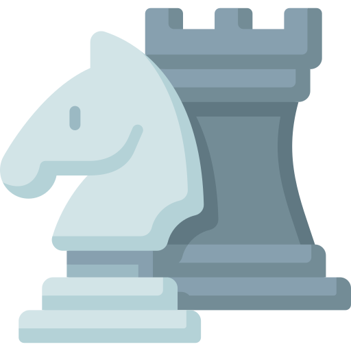

***
# JavaChess 

JavaChess est un jeu d’échecs développé en Java avec une interface graphique Swing, basé sur une architecture MVC. Il propose les règles classiques des échecs ainsi que plusieurs extensions avancées.


## Installation et utilisation

### Prérequis

* Java 8 (recommandé pour éviter les problèmes de DPI sous Windows)
* Maven pour la compilation et la gestion des dépendances

### Compilation

```bash
mvn clean package
```

### Lancement

* Mode graphique (par défaut) :

```bash
java -jar target/JavaChess-1.1-SNAPSHOT.jar
```

* Mode console :

```bash
java -jar target/JavaChess-1.1-SNAPSHOT.jar --mode=console
```


## Structure du projet

* [`doc`](./doc) : Contient la documentation du projet

    * [`ASSETS.md`](./doc/ASSETS.md) : Documentation des assets (images, sons)
* [`src`](./src) : Contient le code source

    * [`main/java`](./src/main/java) : Code Java principal

        * [`modele`](./src/main/java/modele) : Modèle du jeu

            * [`jeu`](./src/main/java/modele/jeu) : Gestion du jeu, joueurs, coups, événements
            * [`mouvement`](./src/main/java/modele/mouvement) : Règles de déplacement via décorateurs
            * [`pieces`](./src/main/java/modele/pieces) : Classes représentant les pièces d’échecs
            * [`plateau`](./src/main/java/modele/plateau) : Modélisation du plateau et des cases
        * [`vue`](./src/main/java/vue) : Interfaces utilisateur (graphique Swing et console)
    * [`resources`](./src/main/resources) : Ressources du projet (images, sons)

        * [`assets/images`](./src/main/resources/assets/images) : Images utilisées dans le jeu
        * [`assets/sons`](./src/main/resources/assets/sons) : Sons utilisés dans le jeu
* [`pom.xml`](./pom.xml) : Fichier de configuration Maven


## Architecture

Le projet suit le modèle MVC :

* **Modèle** (`modele`) : règles du jeu, gestion des pièces, déplacements, état du plateau
* **Vue** (`vue`) : interface graphique Swing et console
* **Contrôleur** : gère les interactions utilisateur et la communication entre modèle et vue

Les déplacements sont gérés via des décorateurs, permettant de moduler facilement les règles.


## Extensions

* Intelligence artificielle avec niveaux de difficulté
* Sauvegarde et chargement au format PGN ou FEN
* Variante Échecs 960
* Fin de partie détectée par répétition
* Mode console complet pour jouer sans interface graphique


## Captures d’écran


